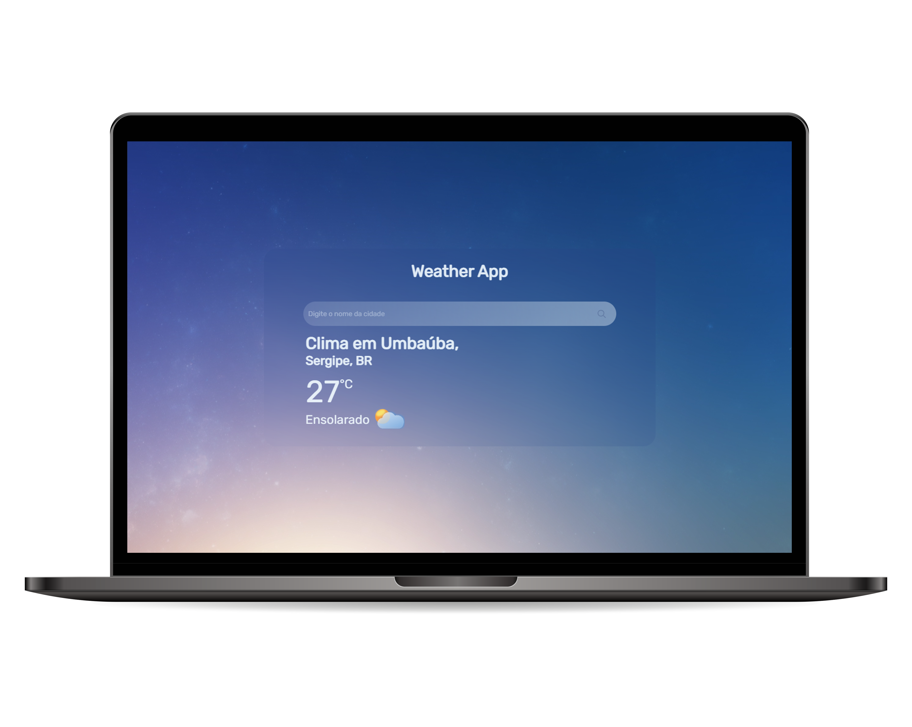

<h1 align="center"> Weather App</h1>

Um aplicativo meteorológico para obter a temperatura e as condições climáticas de uma determinada cidade usando `accuweather`. Uma API meteorológica gratuita.

  <a href="#-tecnologias">Tecnologias</a>&nbsp;&nbsp;&nbsp;|&nbsp;&nbsp;&nbsp;
  <a href="#-projeto">Projeto</a>&nbsp;&nbsp;&nbsp;|&nbsp;&nbsp;&nbsp;
  <a href="#memo-licença">Licença</a>

  

  

## 🚀 Tecnologias

Esse projeto foi desenvolvido com as seguintes tecnologias:

- HTML e CSS
- JavaScript e JSON
- [Node e Yarn](https://nodejs.org/)
- [Vite](https://vitejs.dev/)
- [Axios](https://axios-http.com/ptbr/)
- [AccuWeather](https://developer.accuweather.com/)

## 💻 Projeto

O WeatherApp é um aplicativo meteorológico para obter a temperatura e as condições climáticas de uma determinada cidade usando `accuweather`, uma API meteorológica gratuita.  

- Ao digitar o nome de uma cidade no campo `input` e pressionar enter, o usuário envia o nome da cidade que atualiza o ícone de temperatura, condição do tempo e condição do tempo via DOM.

## :memo: Licença

Esse projeto está sob a licença MIT.

---

## 📧 Contato
david.valentim8@gmail.com
